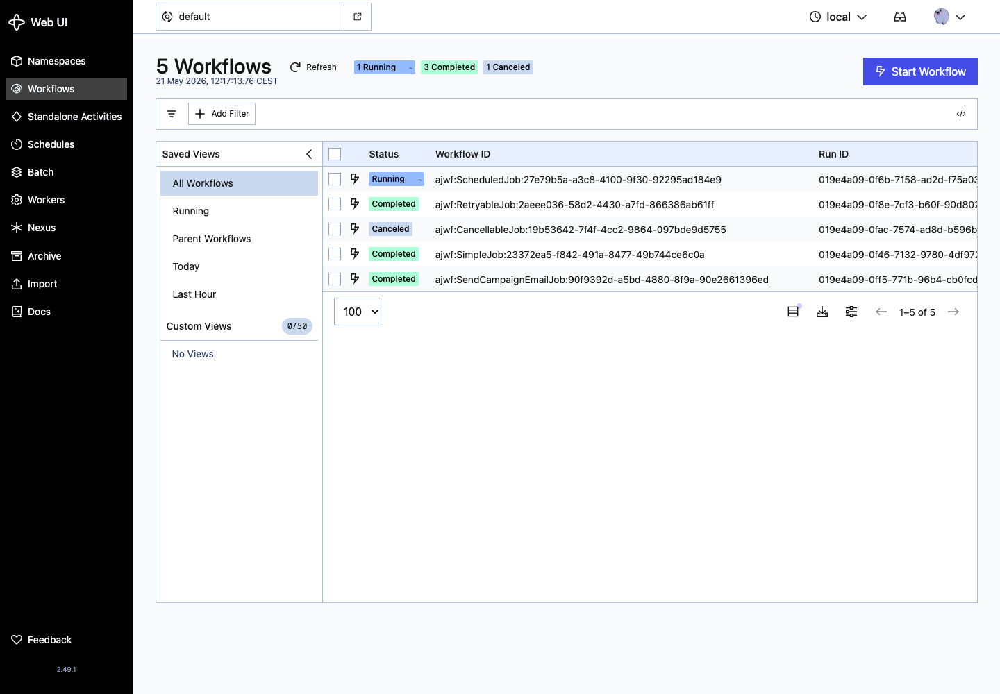
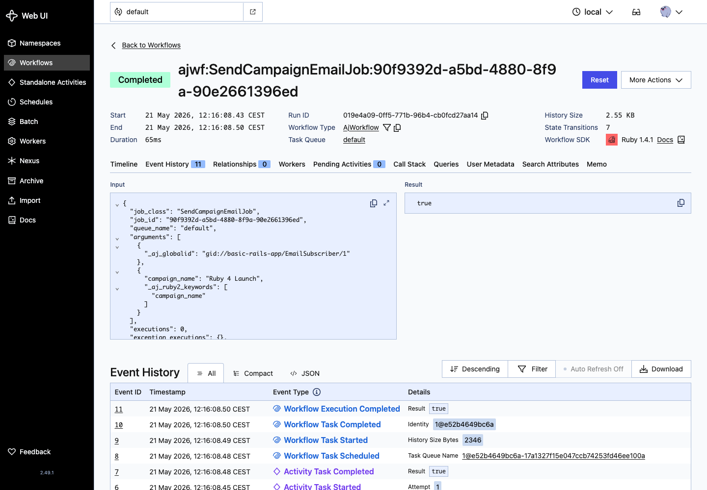
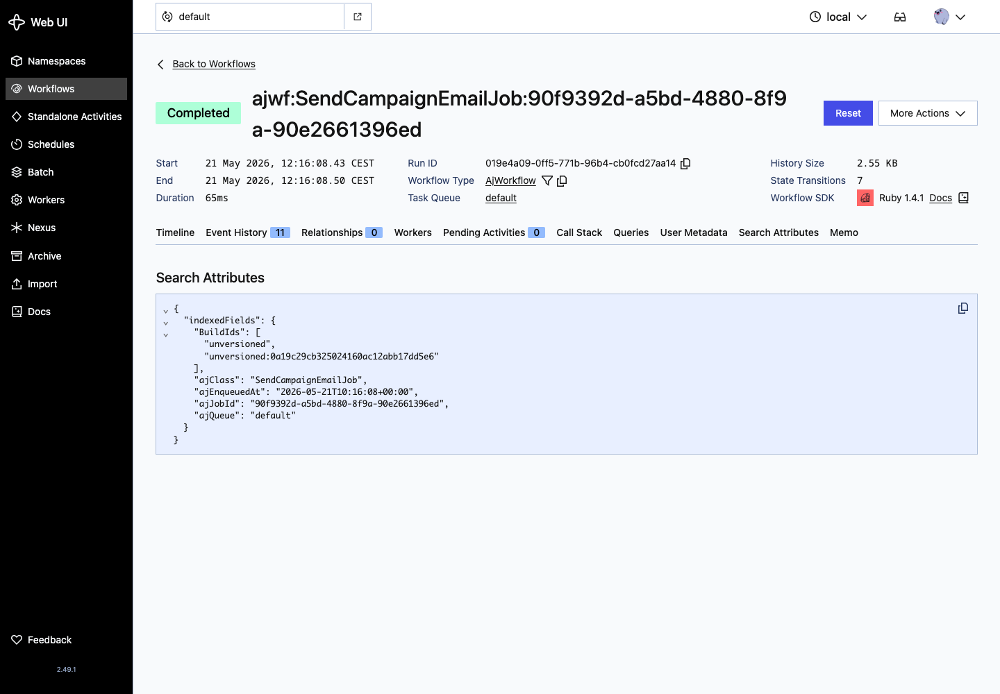

# ActiveJob Temporal - Basic Rails Example

This is a Rails 8 application that demonstrates the core features of the `activejob-temporal` gem. It includes sample jobs showing immediate execution, scheduled jobs, retry behavior, GlobalID serialization, per-job timeouts, and graceful cancellation.

## Features Demonstrated

- **Configuration**: Rails ActiveJob adapter setup plus Temporal target, namespace, task queue, timeout, and retry configuration
- **Simple jobs**: Immediate execution with `SimpleJob.perform_later`
- **Scheduled jobs**: Delayed execution using `set(wait:)`
- **Recurring schedules**: Cron-style schedule declarations using Temporal Schedules
- **Retry policies**: Automatic retry behavior using `retry_on`
- **Cancellation**: API-driven cancellation of running jobs by class and job ID
- **Long-running heartbeats**: Heartbeating for responsive cancellation and liveness on multi-step work
- **GlobalID serialization**: ActiveRecord model arguments passed through ActiveJob GlobalID serialization
- **Per-job timeouts**: `temporal_options` activity timeout declarations on a job class
- **Temporal UI navigation**: Workflow list, history, and search attribute screenshots from the running stack

## Prerequisites

- **Ruby**: 4.0 or higher
- **Rails**: 8.0+
- **Docker**: For running Temporal server locally
- **Docker Compose**: For orchestrating Temporal services

## Quick Start

### Fastest: Docker Compose (Recommended)

The example includes a complete `docker-compose.yml` that starts all services in one command:

```bash
cd examples/basic_rails_app
docker-compose up
```

This will:
1. ✅ Start PostgreSQL (Temporal's database)
2. ✅ Start Temporal Server (port 7233)
3. ✅ Start Temporal UI (port 8080)
4. ✅ Register search attributes automatically
5. ✅ Start the Rails app (port 3000)
6. ✅ Start the Temporal worker

Once running, you'll see output from both the Rails server and worker. The services are ready when you see "Worker started" in the logs.

**Access the services:**
- Rails API: http://localhost:3000
- Temporal UI: http://localhost:8080

That's it! You can now [jump to usage examples](#usage-examples) below.

The Docker Compose startup prepares the database automatically. To refresh the sample subscribers manually:

```bash
docker-compose exec rails-app bin/rails db:seed
```

To stop all services:
```bash
docker-compose down
```

To see logs from a specific service:
```bash
docker-compose logs -f rails-app      # Rails server
docker-compose logs -f temporal-worker  # Temporal worker
docker-compose logs -f temporal         # Temporal server
```

### Alternative: Manual Setup (Without Docker)

If you prefer to run services manually instead of using Docker Compose:

#### 1. Install Dependencies

```bash
cd examples/basic_rails_app
bundle install
```

This will install Rails and the `activejob-temporal` gem from the parent directory.

#### 2. Start Temporal Server

From the **project root directory** (not the example app directory):

```bash
cd ../..  # Go to project root
docker-compose up -d
```

This starts three services:
- **PostgreSQL** (port 5432) - Temporal's database
- **Temporal Server** (port 7233) - Workflow engine
- **Temporal UI** (port 8080) - Web interface for monitoring

Verify services are running:
```bash
docker-compose ps
```

Access the Temporal UI at http://localhost:8080

#### 3. Register Search Attributes

**CRITICAL**: Before starting the worker, you must register search attributes. This is required for workflows to start successfully.

From the project root:

```bash
temporal operator search-attribute create \
  --namespace default \
  --name ajClass --type Keyword \
  --name ajQueue --type Keyword \
  --name ajJobId --type Keyword \
  --name ajEnqueuedAt --type Datetime \
  --name ajTenantId --type Int \
  --name ajTags --type KeywordList
```

**Note**: If you don't have the `temporal` CLI installed, you can run this inside the Docker container:

```bash
docker exec -it temporal temporal operator search-attribute create \
  --namespace default \
  --name ajClass --type Keyword \
  --name ajQueue --type Keyword \
  --name ajJobId --type Keyword \
  --name ajEnqueuedAt --type Datetime \
  --name ajTenantId --type Int \
  --name ajTags --type KeywordList
```

#### 4. Start the Temporal Worker

The worker processes jobs from the Temporal task queue. From the **example app directory**:

```bash
cd examples/basic_rails_app
ACTIVEJOB_TEMPORAL_TARGET=localhost:7233 \
ACTIVEJOB_TEMPORAL_NAMESPACE=default \
ACTIVEJOB_TEMPORAL_TASK_QUEUE=default \
bundle exec temporal-worker
```

You should see output like:
```json
{"event":"worker_started","task_queue":"default","max_concurrent_activities":100,"namespace":"default","target":"localhost:7233","timestamp":"2025-05-01T18:42:13Z"}
```

The worker will block while polling the task queue. Press `Ctrl+C` to gracefully shut down.

**Note**: The gem's `temporal-worker` executable auto-detects Rails when run from the app directory and loads your Rails environment automatically.

#### 5. Start the Rails Server

In a **new terminal**, from the example app directory:

```bash
cd examples/basic_rails_app
rails server -p 3000
```

The API will be available at http://localhost:3000

#### 6. Seed Example Data

Seed the sample email subscribers used by the GlobalID example:

```bash
bin/rails db:prepare
bin/rails db:seed
```

## Usage Examples

### Enqueue a Simple Job

```bash
curl -X POST http://localhost:3000/jobs/simple
```

Response:
```json
{
  "status": "enqueued",
  "job_type": "SimpleJob",
  "job_id": "unique-job-id",
  "queue": "default",
  "message": "Job enqueued successfully"
}
```

### Enqueue a Scheduled Job (30 second delay)

```bash
curl -X POST "http://localhost:3000/jobs/scheduled?delay=30"
```

Response:
```json
{
  "status": "scheduled",
  "job_type": "ScheduledJob",
  "job_id": "unique-job-id",
  "queue": "default",
  "delay_seconds": 30,
  "scheduled_at": "2025-10-29T10:30:00Z",
  "message": "Job scheduled to run in 30 seconds"
}
```

### Enqueue a Retryable Job (will succeed)

```bash
curl -X POST http://localhost:3000/jobs/retryable
```

### Enqueue a Retryable Job (will fail and retry)

```bash
curl -X POST "http://localhost:3000/jobs/retryable?should_fail=true"
```

This job will fail on the first 2 attempts and succeed on the 3rd, demonstrating automatic retry behavior.

Response includes a stable `attempt_key` that the demo job uses to track transient attempts across Temporal activity retries:
```json
{
  "status": "enqueued",
  "job_type": "RetryableJob",
  "job_id": "550e8400-e29b-41d4-a716-446655440000",
  "queue": "default",
  "will_fail": true,
  "attempt_key": "78e5c3b7-1bf8-4ecb-9f4c-45585b8d4fc0",
  "message": "Job will fail and retry up to 5 times"
}
```

### Enqueue a Long-Running Cancellable Job

```bash
curl -X POST "http://localhost:3000/jobs/cancellable?iterations=20"
```

Response includes the `job_id` you'll need for cancellation:
```json
{
  "status": "enqueued",
  "job_type": "CancellableJob",
  "job_id": "550e8400-e29b-41d4-a716-446655440000",
  "queue": "default",
  "iterations": 20,
  "estimated_duration": "40 seconds",
  "message": "Long-running job enqueued. Use DELETE /jobs/cancel with job_id to cancel it."
}
```

### Enqueue a Campaign Email Job with GlobalID

Seeded subscribers are ActiveRecord models. Passing one to `SendCampaignEmailJob` demonstrates ActiveJob GlobalID serialization:

```bash
curl -X POST "http://localhost:3000/jobs/campaign_email?campaign_name=Spring%20Launch"
```

Use a specific subscriber from the seed data:

```bash
curl -X POST "http://localhost:3000/jobs/campaign_email?subscriber_id=1&campaign_name=Spring%20Launch"
```

Response:

```json
{
  "status": "enqueued",
  "job_type": "SendCampaignEmailJob",
  "job_id": "unique-job-id",
  "queue": "default",
  "subscriber_id": 1,
  "subscriber_gid": "gid://.../EmailSubscriber/1",
  "campaign_name": "Spring Launch",
  "message": "Campaign email job enqueued with a GlobalID subscriber argument"
}
```

### Cancel a Running Job

```bash
curl -X DELETE "http://localhost:3000/jobs/cancel?job_class=CancellableJob&job_id=550e8400-e29b-41d4-a716-446655440000"
```

Response:
```json
{
  "status": "cancelled",
  "job_class": "CancellableJob",
  "job_id": "550e8400-e29b-41d4-a716-446655440000",
  "message": "Cancellation request sent. The job will stop at the next heartbeat."
}
```

## Monitoring Jobs in Temporal UI

1. Open http://localhost:8080 in your browser
2. Click on the "default" namespace
3. You'll see all workflows (jobs) with their status:
   - **Running**: Job is currently executing
   - **Completed**: Job finished successfully
   - **Failed**: Job failed after all retries
   - **Cancelled**: Job was cancelled
4. Click on any workflow to see:
   - Execution history
   - Input/output payloads
   - Activity attempts and retries
   - Stack traces for failures

### Searching Workflows

Use the search attributes to filter workflows:

```
ajClass = "SimpleJob"
ajQueue = "default"
ajJobId = "specific-job-id"
ajEnqueuedAt > "2025-10-29T00:00:00Z"
```

### Temporal UI Screenshots

These screenshots were captured from the Docker Compose stack after enqueueing the example jobs.







## Configuration

### ActiveJob Adapter

The adapter is configured in `config/initializers/active_job.rb`:

```ruby
ActiveJob::Base.queue_adapter = :temporal unless Rails.env.test?
```

### Temporal Connection

The connection settings are in `config/initializers/activejob_temporal.rb`:

```ruby
ActiveJob::Temporal.configure do |config|
  config.target = ENV.fetch("ACTIVEJOB_TEMPORAL_TARGET", "127.0.0.1:7233")
  config.namespace = ENV.fetch("ACTIVEJOB_TEMPORAL_NAMESPACE", "default")
  config.task_queue = ENV.fetch("ACTIVEJOB_TEMPORAL_TASK_QUEUE", "default")
  config.default_activity_timeout = 15.minutes
  config.default_retry_initial_interval = 30.seconds
  config.default_retry_backoff = 2.0
  config.default_retry_max_attempts = 1
end
```

See the [full configuration reference](../../docs/configuration_reference.md) for all available options.

## Job Definitions

### SimpleJob

```ruby
class SimpleJob < ApplicationJob
  queue_as :default

  def perform(message)
    Rails.logger.info "SimpleJob executed with message: #{message}"
  end
end
```

### ScheduledJob

```ruby
class ScheduledJob < ApplicationJob
  queue_as :default

  def perform(message, scheduled_at = nil)
    Rails.logger.info "ScheduledJob executed at #{Time.current}"
  end
end
```

### RecurringReportJob

```ruby
class RecurringReportJob < ApplicationJob
  queue_as :default

  schedule cron: "0 2 * * *", timezone: "UTC", overlap_policy: :skip

  def perform
    Rails.logger.info "RecurringReportJob executed at #{Time.current}"
  end
end
```

Register the schedule explicitly during deployment or from a Rails task:

```ruby
RecurringReportJob.create_temporal_schedule
```

### RetryableJob

```ruby
class RetryableJob < ApplicationJob
  queue_as :default

  retry_on RetryableJobError, wait: 5.seconds, attempts: 5

  def perform(message, should_fail: false, attempt_key: job_id)
    cache_key = "retryable_job_attempts/#{attempt_key}"
    attempt = Rails.cache.fetch(cache_key) { 0 } + 1
    Rails.cache.write(cache_key, attempt, expires_in: 10.minutes)

    raise RetryableJobError if should_fail && attempt < 3

    Rails.cache.delete(cache_key) if should_fail
  end
end
```

### CancellableJob

```ruby
class CancellableJob < ApplicationJob
  queue_as :default

  temporal_options start_to_close_timeout: 2.minutes, heartbeat_timeout: 10.seconds

  def perform(iterations = 10)
    iterations.times do |i|
      Temporalio::Activity::Context.current.heartbeat # Required for cancellation
      sleep 2
      # Do work
    end
  end
end
```

**Key Point**: The `heartbeat` call is essential for graceful cancellation. Without it, the job will only be cancelled after it completes.

### SendCampaignEmailJob

```ruby
class SendCampaignEmailJob < ApplicationJob
  queue_as :default

  discard_on ActiveJob::DeserializationError

  def perform(email_subscriber, campaign_name:)
    return unless email_subscriber.subscribed?

    email_subscriber.update!(
      last_campaign_name: campaign_name,
      last_campaign_sent_at: Time.current
    )
  end
end
```

`email_subscriber` is an ActiveRecord model. ActiveJob serializes it as a GlobalID before the job is sent to Temporal and deserializes it before `perform` runs.

## Running Tests

The example app includes Minitest coverage for the model, GlobalID job serialization, per-job timeout declarations, and controller enqueue endpoints:

```bash
bin/rails db:prepare
bin/rails test
```

## Testing the Complete Workflow

Here's a complete test scenario:

```bash
# 1. Start all services (see Quick Start above)

# 2. Enqueue a long-running job
curl -X POST "http://localhost:3000/jobs/cancellable?iterations=20"
# Note the job_id from the response

# 3. Check Temporal UI - you should see the job running
# Open http://localhost:8080

# 4. Cancel the job after a few seconds
curl -X DELETE "http://localhost:3000/jobs/cancel?job_class=CancellableJob&job_id=YOUR_JOB_ID"

# 5. Check worker logs - you should see cancellation message
# Check Temporal UI - job should show as "Cancelled"

# 6. Test retry behavior
curl -X POST "http://localhost:3000/jobs/retryable?should_fail=true"

# 7. Check Temporal UI - you should see multiple activity attempts

# 8. Test GlobalID serialization with a seeded subscriber
curl -X POST "http://localhost:3000/jobs/campaign_email?subscriber_id=1&campaign_name=Spring%20Launch"
```

## Troubleshooting

### Jobs Not Executing

1. **Check worker is running**: Look for "Worker started" message
2. **Check Temporal server**: Run `docker-compose ps` - all services should be "Up"
3. **Check search attributes**: Run the registration command again
4. **Check logs**: Worker logs and Rails server logs for errors

### "Workflow execution not found" Error

This usually means search attributes weren't registered. Run the registration command from step 3.

### Jobs Execute But Fail Immediately

1. **Check worker location**: Ensure you're running from the example app directory (`cd examples/basic_rails_app`)
2. **Check Rails environment**: Verify the Rails app loaded correctly (you should see Rails boot messages)
3. **Check job class**: Ensure it inherits from `ApplicationJob`
4. **Check gem installation**: Run `bundle install` in the app directory

### Cancellation Not Working

1. **Check heartbeating**: Job must call `Temporalio::Activity::Context.current.heartbeat`
2. **Check job is still running**: Can't cancel completed jobs
3. **Check job_id**: Must match exactly (case-sensitive)

## Cleanup

### If using Docker Compose (recommended):

```bash
# Stop all services
docker-compose down

# To also remove volumes (databases, persisted data):
docker-compose down -v

# To remove built images:
docker-compose down --rmi all
```

### If using manual setup:

```bash
# Stop Rails server (Ctrl+C in terminal)

# Stop worker (Ctrl+C in terminal)

# Stop Temporal services from project root
cd ../..  # Go to project root
docker-compose down

# To also remove volumes (databases):
docker-compose down -v
```

## How the Worker Auto-Detects Rails

The gem's `temporal-worker` executable uses **smart Rails auto-detection** (similar to Sidekiq):

1. When you run `bundle exec temporal-worker` from the example app directory
2. It checks for `config/application.rb` in the current directory
3. If found, it automatically loads your Rails environment
4. Job classes and configuration become available to the worker

This means:
- **No duplicate binstubs needed** - just use the gem's executable
- **Works from any Rails app** - no special setup required
- **Auto-detects automatically** - run from the app directory and it "just works"

To use in your own Rails app:
```bash
cd your-app
bundle exec temporal-worker
```

The worker will automatically detect your Rails app and load it!

## Next Steps

- Read the [main README](../../README.md) for complete API documentation
- Check [configuration reference](../../docs/configuration_reference.md) for all options
- See [migration guide](../../docs/migration_guide.md) to integrate into existing Rails apps
- Check [Worker Setup Guide](../../docs/worker_setup.md) for additional worker configuration

## Support

For issues and questions:
- GitHub: https://github.com/schovi/activejob-temporal
- Documentation: See `docs/` directory in the gem root
